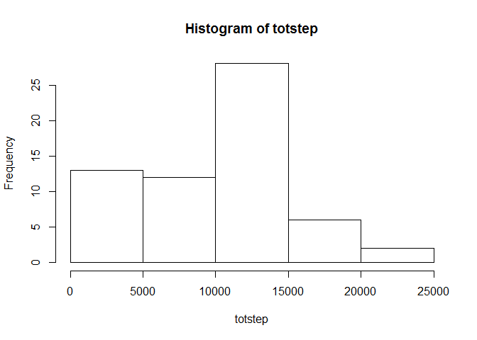
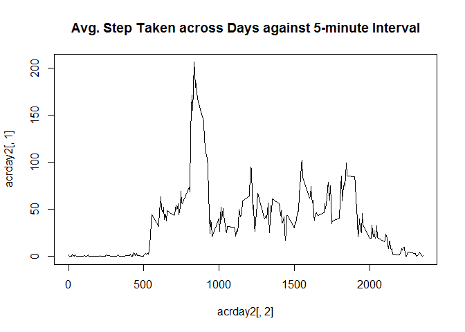
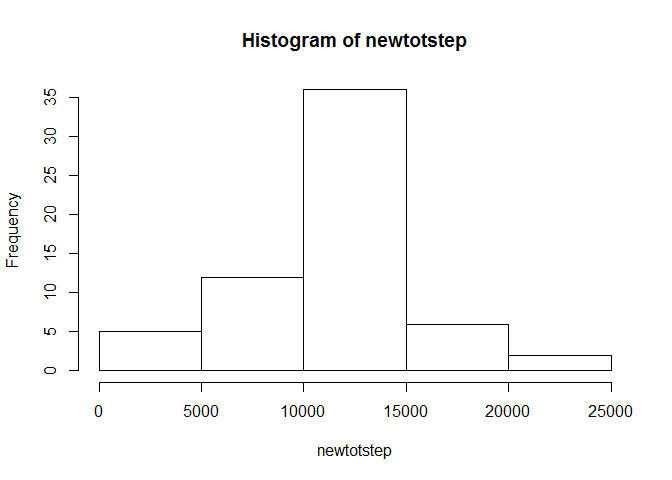
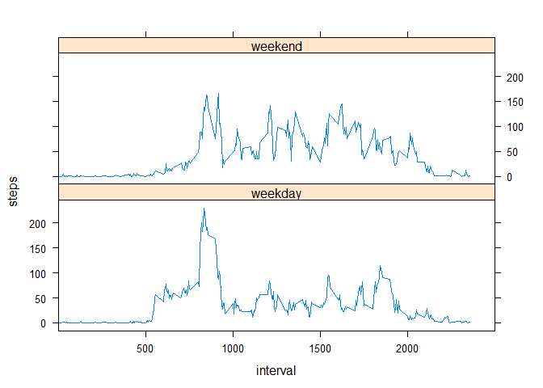

Reproducible Research Assignment 1  
==================================  
&nbsp;

## Introduction

This document is an assignment submission for the Reproducible Research course on Coursera.  
&nbsp;

## Loading and preprocessing the data

Here, we will be loading the dataset onto r.


```r
data <- read.csv("activity.csv")
data[,2] <- as.Date(data[,2])
```
&nbsp;

## What is mean total number of steps taken per day?

Here, we will use tapply to calculate the total number of steps taken per day.


```r
totstep <- tapply(data[,1], data[,2], sum, na.rm = TRUE)
totstep
```

```
## 2012-10-01 2012-10-02 2012-10-03 2012-10-04 2012-10-05 2012-10-06 
##          0        126      11352      12116      13294      15420 
## 2012-10-07 2012-10-08 2012-10-09 2012-10-10 2012-10-11 2012-10-12 
##      11015          0      12811       9900      10304      17382 
## 2012-10-13 2012-10-14 2012-10-15 2012-10-16 2012-10-17 2012-10-18 
##      12426      15098      10139      15084      13452      10056 
## 2012-10-19 2012-10-20 2012-10-21 2012-10-22 2012-10-23 2012-10-24 
##      11829      10395       8821      13460       8918       8355 
## 2012-10-25 2012-10-26 2012-10-27 2012-10-28 2012-10-29 2012-10-30 
##       2492       6778      10119      11458       5018       9819 
## 2012-10-31 2012-11-01 2012-11-02 2012-11-03 2012-11-04 2012-11-05 
##      15414          0      10600      10571          0      10439 
## 2012-11-06 2012-11-07 2012-11-08 2012-11-09 2012-11-10 2012-11-11 
##       8334      12883       3219          0          0      12608 
## 2012-11-12 2012-11-13 2012-11-14 2012-11-15 2012-11-16 2012-11-17 
##      10765       7336          0         41       5441      14339 
## 2012-11-18 2012-11-19 2012-11-20 2012-11-21 2012-11-22 2012-11-23 
##      15110       8841       4472      12787      20427      21194 
## 2012-11-24 2012-11-25 2012-11-26 2012-11-27 2012-11-28 2012-11-29 
##      14478      11834      11162      13646      10183       7047 
## 2012-11-30 
##          0
```

Next, we will plot a histogram of the table.


```r
hist(totstep)
```

 

Finally, we will calculate the mean and median of steps taken per day.  

Mean:


```r
mea <- mean(totstep)
mea
```

```
## [1] 9354.23
```

Median:


```r
med <- median(totstep)
med
```

```
## [1] 10395
```
&nbsp;

## What is the average daily activity pattern?

Here, we will use tapply to find the average steps taken across all days, and then make a time series plot.


```r
acrday <- tapply(data[,1], data[,3], mean, na.rm = TRUE)
library(dplyr)
acrday1 <- data.frame(acrday)
acrday2 <- mutate(acrday1, interval = rownames(acrday1))
plot(acrday2[,2], acrday2[,1], type = "l", main = "Avg. Step Taken across Days against 5-minute Interval")
```

 

Now, we find the 5-minute interval which contains the maximum number of steps.


```r
max <- names(acrday[acrday == max(acrday)])
```

The 5-minute interval is 835.
&nbsp;

## Imputing missing values

There are a number of missing values in the dataset. Here, We will calulate the total number of missing values.


```r
totna <- sum(is.na(data))
```

The total number of missing values is 2304.  
&nbsp;


We will fill in the missing values by taking the mean of the 5-minute interval.


```r
library(plyr)
newdata <- join(data, acrday2, by='interval')
newdata <- mutate(newdata, steps = ifelse(is.na(steps), acrday, steps))
```

Now that the missing data is filled in, we will make a histogram of the total number of steps taken each day.


```r
newtotstep <- tapply(newdata[,1], newdata[,2], sum, na.rm = TRUE)
hist(newtotstep)
```

 

And now recalculate the mean and median total number of steps taken per day.

Mean:


```r
newmea <- mean(newtotstep)
newmea
```

```
## [1] 10766.19
```

Median:


```r
newmed <- median(newtotstep)
newmed
```

```
## [1] 10766.19
```

Both the mean and median values increased as compared to the first part of the assignment.
Imputing missing data greatly reduced the frequency of 0-5000 total steps, and was replaced with higher values. Thus it comes as no surprise that the mean and median are higher too.  
&nbsp;

## Are there differences in activity patterns between weekdays and weekends?

Here we will add a new column 'daytype', to indicate whether the given date is weekday or weekend.


```r
data2 <- mutate(newdata, daytype = weekdays(date))
data2 <- mutate(data2, daytype = ifelse(daytype=="Saturday" | daytype=="Sunday", "weekend", "weekday"))
data2[,5] <- as.factor(data2[,5])
```

Now we make a panel plot of the 5-minute interval and the average number of steps taken, averaged across all weekday days or weekend days.


```r
list <- split(data2, data2$daytype)
day <- data.frame(list[1])
end <- data.frame(list[2])
aday <- tapply(day[,1], day[,3], mean, na.rm = TRUE)
aday <- data.frame(aday)
aday <- mutate(aday, interval = rownames(aday))
aday <- mutate(aday, daytype = "weekday")
aday <- rename(aday, c("aday" = "steps"))

aend <- tapply(end[,1], end[,3], mean, na.rm = TRUE)
aend <- data.frame(aend)
aend <- mutate(aend, interval = rownames(aend))
aend <- mutate(aend, daytype = "weekend")
aend <- rename(aend, c("aend" = "steps"))

comb <- rbind(aday, aend)
comb[,3] <- as.factor(comb[,3])

library(lattice)
xyplot(steps ~ interval | daytype, data = comb, layout = c(1,2), type = "l", xlim = c(0,2500), scales=list(x=list(at=c(500,1000,1500,2000))))
```

 
